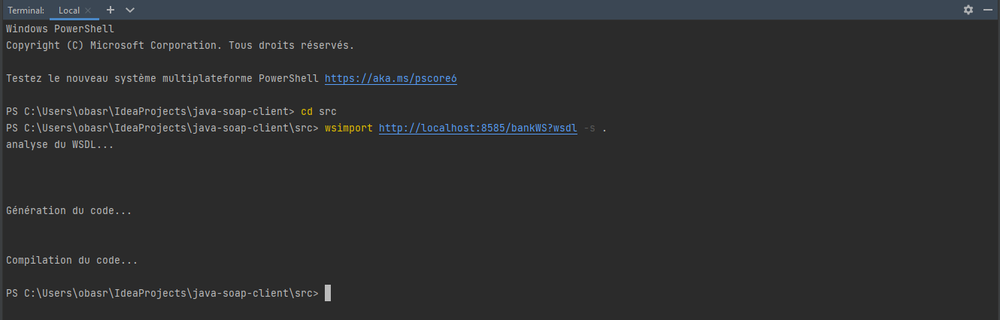
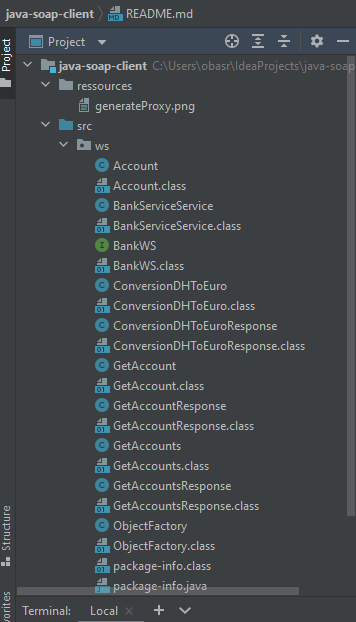

# JAVA SOAP Client

## Generate Proxy (Java classes) from WSDL Schema with command line



## Generated code




## invoke methods of web service from jva soup client

```java
public class WSClient {
    public static void main(String[] args) {
        BankWS bankWS = new BankService().getBankWSPort();

        System.out.println("\n---------------Convert Dh to Euro");

        double response = bankWS.conversionDHToEuro(30);
        System.out.println(response);

        System.out.println("\n---------------Get Account------------------------");

        Account account = bankWS.getAccount(1L);
        System.out.println(account.getId());
        System.out.println(account.getBalance());
        System.out.println(account.isActive());

        System.out.println("\n---------------Get Accounts------------------------");
        List<Account> accounts = bankWS.getAccounts();
        accounts.forEach(account1 -> {
            System.out.println(account1.getId());
            System.out.println(account1.getBalance());
            System.out.println(account1.isActive());
            System.out.println("************");
        });
    }
}

``` 
